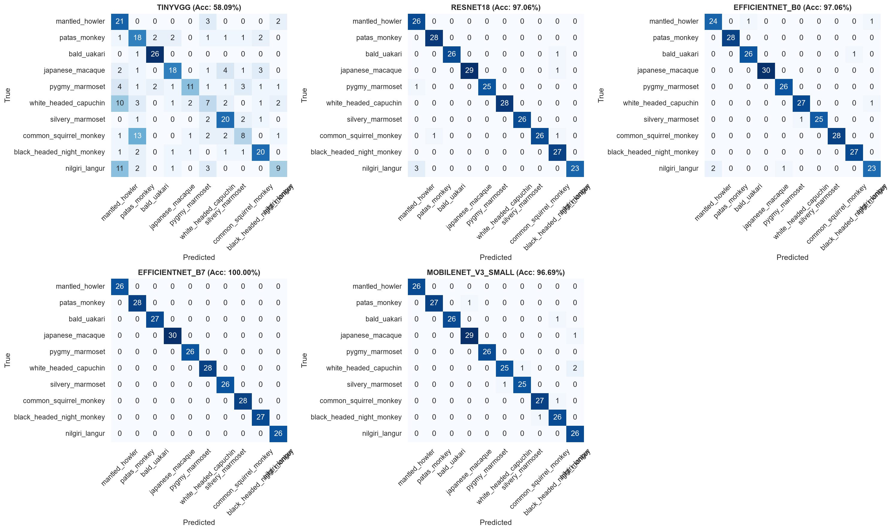

# Deep Learning Architecture Comparison & Transfer Learning Benchmark

A comprehensive benchmarking project evaluating **5 distinct Computer Vision architectures** (1 custom baseline trained from scratch vs. 4 feature-extractor transfer learning models) on the [10-Monkey-Species Dataset](https://www.kaggle.com/datasets/slothkong/10-monkey-species).

---

## 🎯 Project Overview

The objective of this benchmark is to empirically investigate the benefits of **Transfer Learning** on domain-specific, small-scale datasets compared to training from scratch. We systematically compare model capacity, training throughput, convergence rate, and generalization accuracy across varied architectural paradigms.

All models were evaluated under identical experimental conditions:
* **Dataset:** 10 Monkey Species (1,097 train images, 272 validation images)
* **Epochs:** 10 epochs per model
* **Optimizer:** Adam (Learning Rate = 0.001)
* **Loss Function:** Cross-Entropy Loss
* **Hardware Acceleration:** NVIDIA GeForce RTX 5060 Laptop GPU (Blackwell Architecture, Compute Capability 12.0) with PyTorch AMP (Automatic Mixed Precision)

> **Note on reproducibility:** The results below are the executed outputs of the canonical
> notebook (`notebooks/transfer_learning_monkey_species.ipynb`), mirrored into `results/`.
> Because the DataLoader shuffle order is not seed-locked, re-running the benchmark (e.g. via
> the CLI pipeline `python src/run_all.py` or on Kaggle) may produce marginally different
> values (e.g. ±0.4% accuracy); the notebook also reports training time for the training loop
> only, excluding model construction.

---

## 🏗️ Evaluated Architectures

| Architecture | Paradigm | Input Resolution | Description & Rationale |
|---|---|---|---|
| **TinyVGG** | Scratch (Baseline) | 64 × 64 | Classic 4-layer CNN baseline designed to showcase performance limits when training from scratch on small datasets without pretrained feature priors. |
| **ResNet-18** | Transfer Learning | 224 × 224 | Residual network utilizing skip connections to eliminate vanishing gradients; provides an efficient, strong baseline for transfer learning. |
| **EfficientNet-B0** | Transfer Learning | 224 × 224 | Utilizes compound scaling (depth, width, resolution) with Mobile Inverted Bottlenecks (MBConv) for maximum parameter efficiency. |
| **EfficientNet-B7** | Transfer Learning | 600 × 600 | High-capacity scaled architecture with 63.8M parameters designed for state-of-the-art visual feature representation on high-resolution inputs. |
| **MobileNetV3-Small** | Transfer Learning | 224 × 224 | Hardware-aware neural architecture search (NAS) model optimized for ultra-low latency and edge deployment scenarios. |

---

## 📊 Benchmark Results

### Performance Summary Table

| Model | Test Accuracy (%) | Test Loss | Training Time (s) | Total Parameters | Trainable Parameters | Frozen Parameters |
|---|---|---|---|---|---|---|
| **TinyVGG** *(Scratch Baseline)* | **58.09%** | 1.8172 | 131.79s | 48,378 | 48,378 (100%) | 0 |
| **ResNet-18** *(Pretrained)* | **97.06%** | 0.1337 | 159.08s | 11,181,642 | 5,130 (0.05%) | 11,176,512 |
| **EfficientNet-B0** *(Pretrained)* | **97.06%** | 0.1428 | 179.78s | 4,020,358 | 12,810 (0.32%) | 4,007,548 |
| **EfficientNet-B7** *(Pretrained)* | **100.00%** | 0.0408 | 496.34s | 63,812,570 | 25,610 (0.04%) | 63,786,960 |
| **MobileNetV3-Small** *(Pretrained)* | **96.69%** | 0.1503 | 167.43s | 1,528,106 | 10,250 (0.67%) | 1,517,856 |

### 📈 Comparative Visualizations



---

## 🔍 Key Empirical Findings

1. **Pretrained Representations are Essential for Small Datasets:**
   * **TinyVGG (Scratch)** achieved only **58.09% accuracy** after 10 epochs. Due to the limited dataset size (~1,100 training images across 10 classes), the scratch model lacked the inductive priors necessary to generalize effectively, resulting in severe overfitting.
   * In contrast, all four pretrained models reached **over 96.6% accuracy within just 1 to 2 epochs**, demonstrating that ImageNet feature priors transfer seamlessly to specialized visual domains.

2. **Highest Overall Accuracy:**
   * **EfficientNet-B7** attained **100.00% validation accuracy** (Test Loss: 0.0408). Its 600×600 high-resolution feature maps capture fine-grained primate textural characteristics that smaller resolution models might overlook.

3. **Optimal Efficiency Sweet Spot:**
   * **EfficientNet-B0** delivered **97.06% accuracy** with only 4.02M parameters and ~180 seconds of training time, outperforming ResNet-18 while utilizing less than 40% of its parameters.
   * **MobileNetV3-Small** achieved **96.69% accuracy** with merely **1.53M total parameters** (and only 10,250 trainable parameters in the classifier head), making it the prime candidate for edge and resource-constrained inference.

4. **Throughput vs. Memory Trade-Off:**
   * Training time scaled with input resolution and depth: 224×224 models (ResNet-18, EffNet-B0, MobileNetV3) required ~159–180 seconds, whereas the 600×600 EfficientNet-B7 required ~496 seconds.

---

## 📁 Repository Structure

```text
transfer-learning-monkey-species/
├── notebooks/                          # Interactive Jupyter Notebooks
│   ├── transfer_learning_monkey_species.ipynb  # Executed full 5-model benchmark walkthrough
│   └── kernel-metadata.json            # Kaggle metadata configuration
├── data/                               # Dataset directory (excluded from git)
│   ├── training/training/{n0...n9}
│   ├── validation/validation/{n0...n9}
│   └── monkey_labels.txt
├── src/
│   ├── data_setup.py                   # Dynamic transforms & DataLoader builder
│   ├── engine.py                       # AMP training loop, inference engine & metrics
│   ├── models.py                       # Model factory (TinyVGG + 4 Pretrained architectures)
│   ├── utils.py                        # Plotting, parameter counting, checkpoint & metrics persistence
│   ├── train.py                        # CLI tool for single-model training with OOM retry
│   └── run_all.py                      # Multi-model automated benchmark orchestrator
├── results/
│   ├── comparison_chart.png            # 4-panel visual summary
│   ├── comparison_table.csv            # Tabular performance metrics
│   ├── tinyvgg/                        # Loss, accuracy, confusion matrix & metrics
│   ├── resnet18/
│   ├── efficientnet_b0/
│   ├── efficientnet_b7/
│   └── mobilenet_v3_small/
├── compare_models.py                   # Aggregator and charting script
├── requirements.txt                    # Exact pinned dependencies
├── .gitignore
└── README.md
```

---

## 🚀 Getting Started

### 1. Prerequisites & GPU Environment

This project requires Python 3.10+ and a CUDA-compatible GPU. `requirements.txt` already pins
the PyTorch CUDA 12.8 build (`torch==2.11.0+cu128`) for modern **NVIDIA RTX 50-series
(Blackwell / sm_120)** or RTX 40-series cards.

```bash
# Create and activate virtual environment
python -m venv .venv
.\.venv\Scripts\activate

# Install project dependencies (including PyTorch CUDA 12.8)
pip install -r requirements.txt
```

> If you prefer to install PyTorch explicitly (or need CUDA 12.8 wheels directly):
> `pip install torch torchvision --index-url https://download.pytorch.org/whl/cu128`

### 2. Dataset Download

Download and extract the 10-Monkey-Species dataset via the Kaggle CLI:

```bash
kaggle datasets download -d slothkong/10-monkey-species -p data --unzip
```

### 3. Interactive Jupyter Notebook

You can run the full benchmark interactively with all visualizations embedded:

```bash
jupyter notebook notebooks/transfer_learning_monkey_species.ipynb
```

### 4. Modular CLI Training

To train an individual architecture:

```bash
python src/train.py --model resnet18 --epochs 10 --batch_size 32
python src/train.py --model efficientnet_b7 --epochs 10 --batch_size 8
```

To run all 5 models sequentially and generate benchmark artifacts:

```bash
python src/run_all.py --epochs 10
python compare_models.py
```

### 5. Running on Kaggle

The notebook is fully self-contained and can be pushed directly to Kaggle (see `notebooks/kernel-metadata.json`):

```bash
kaggle kernels push -p notebooks
```

* **Internet access** is required (enabled in the kernel metadata) to download the pretrained weights.
* Kaggle's default `GPU` slot is often a **Tesla P100 (sm_60)**, which the preinstalled
  PyTorch 2.10.0+cu128 does not support. The notebook detects this and automatically
  reinstalls a compatible cu126 PyTorch build before importing torch. Selecting a **T4** or
  **L4** GPU in the Kaggle notebook settings avoids this one-time reinstall.
* Results are displayed inline in the notebook; persist CSV/PNG artifacts to `/kaggle/working` if you want them downloadable from the kernel "Output" tab.

---

## 📜 Dataset & Kaggle Notebook References

* **Kaggle Notebook:** [Transfer Learning 10 Monkey Species on Kaggle](https://www.kaggle.com/code/emrezorlu1239/transfer-learning-10-monkey-species)
* **Dataset:** [10 Monkey Species Dataset on Kaggle](https://www.kaggle.com/datasets/slothkong/10-monkey-species)
* **Dataset Creator:** SlothKong
* **License:** Public Domain / Creative Commons (CC0)
